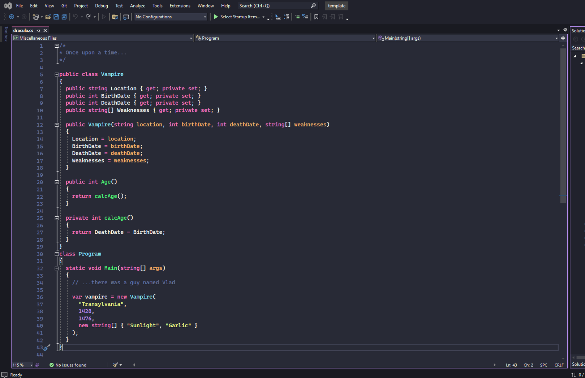

# Dracula for [Visual Studio](http://visualstudio.com)

> A dark theme for [Visual Studio](http://visualstudio.com).

## Install

All instructions can be found at [draculatheme.com/visual-studio](https://draculatheme.com/visual-studio).

## Related
* [Visual Studio 2012](https://github.com/dracula/visual-studio/tree/2012)

## Team

This theme is maintained by the following person(s) and a bunch of [awesome contributors](https://github.com/dracula/visual-studio/graphs/contributors).

 |
--- |
[Tim Zenner](https://github.com/epidemicz) |

## License

[MIT License](./LICENSE)
